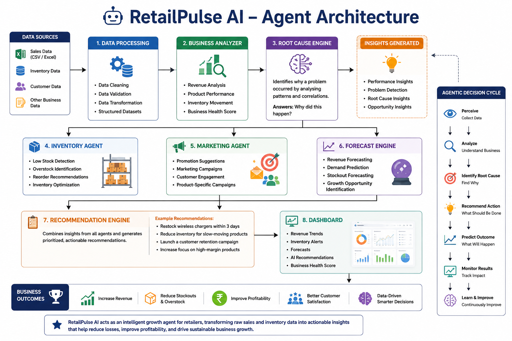

# 🏗️ RetailPulse AI – Agent Architecture

---

## 📖 Introduction

RetailPulse AI is an autonomous business growth agent designed to help retailers transform raw sales, inventory, and customer data into intelligent business decisions. The system continuously analyzes business performance, identifies hidden operational issues, predicts future risks, and recommends actions that improve profitability.

Unlike traditional retail software that only stores data and generates reports, RetailPulse AI acts as an intelligent business assistant that helps retailers understand what is happening in their business and what actions should be taken to improve performance.

---

---

## 🧩 System Components

### 1. 📥 Data Processing Layer

This component collects and processes business data from various sources such as sales records, inventory reports, and customer information.

Functions:

- Data Collection
- Data Cleaning
- Data Validation
- Data Structuring

---

### 2. 📊 Business Analyzer

The Business Analyzer evaluates overall business performance and identifies trends.

Functions:

- Revenue Analysis
- Product Performance Tracking
- Sales Trend Analysis
- Business Health Monitoring

---

### 3. 🧠 Root Cause Engine

This component identifies the reasons behind business problems instead of simply reporting them.

Functions:

- Revenue Loss Detection
- Performance Analysis
- Business Problem Identification
- Root Cause Discovery

---

### 4. 📦 Inventory Agent

The Inventory Agent continuously monitors inventory levels and product movement.

Functions:

- Low Stock Detection
- Overstock Detection
- Reorder Recommendations
- Inventory Optimization

---

### 5. 📢 Marketing Agent

This component helps retailers improve sales and customer engagement.

Functions:

- Campaign Suggestions
- Promotion Generation
- Customer Retention Strategies
- Product Marketing Recommendations

---

### 6. 📈 Forecast Engine

The Forecast Engine predicts future business conditions.

Functions:

- Revenue Forecasting
- Demand Prediction
- Inventory Forecasting
- Growth Opportunity Detection

---

### 7. 🎯 Recommendation Engine

The Recommendation Engine combines insights from all modules and generates actionable recommendations.

Functions:

- Business Recommendations
- Priority-Based Actions
- Growth Suggestions
- Performance Improvement Strategies

---

### 8. 🖥️ Dashboard Interface

The dashboard presents all generated insights in an easy-to-understand format.

Displays:

- Revenue Trends
- Inventory Alerts
- Business Health Score
- Forecast Reports
- AI Recommendations

---

## ⚙️ Working Process

RetailPulse AI begins by collecting sales records, inventory information, and customer-related data from the business. The collected data is cleaned, organized, and prepared for analysis.

The Business Analyzer evaluates overall business performance by examining revenue trends, product sales, inventory movement, and customer purchasing patterns. Whenever unusual changes are detected, the Root Cause Engine investigates the factors responsible for those changes.

Based on the findings, the Inventory Agent checks for stock shortages, excess inventory, and reorder requirements, while the Marketing Agent identifies opportunities to improve sales through promotional activities and customer engagement strategies.

The Forecast Engine predicts future demand, revenue trends, and inventory risks using historical business data. These predictions help retailers make proactive decisions before problems affect profitability.

Finally, the Recommendation Engine combines insights from all components and generates clear business recommendations. These recommendations are displayed on the dashboard, allowing business owners to make informed decisions quickly and effectively.

---

## 🚀 How RetailPulse AI Differs from Existing Solutions

Most existing retail tools focus on recording transactions, storing inventory information, and generating reports. While they provide useful data, business owners must still interpret the information and decide what actions to take.

RetailPulse AI goes beyond traditional reporting by automatically identifying problems, determining root causes, predicting future outcomes, and generating actionable recommendations.

Traditional Solutions:
- Show business data
- Generate reports
- Require manual analysis

RetailPulse AI:
- Detects business problems automatically
- Explains why problems occurred
- Recommends corrective actions
- Predicts future business outcomes
- Supports data-driven growth

---

## 🌍 Applications

RetailPulse AI can be used in:

- Grocery Stores
- Kirana Stores
- Supermarkets
- Mobile and Electronics Shops
- Pharmacies
- Clothing Retailers
- Department Stores
- Franchise Businesses
- Multi-Store Retail Chains

---

## 💰 Estimated Project Cost

| Component | Cost |
|------------|------------|
| Frontend Development | Open Source |
| Backend Development | Open Source |
| Database | Open Source |
| AI Integration | ₹2,000 - ₹5,000 |
| Cloud Hosting | ₹1,000 - ₹2,000 |
| Testing & Deployment | ₹1,000 |
| Total Estimated Cost | ₹4,000 - ₹8,000 |

The prototype version can be developed using free and student-tier resources, making it cost-effective and scalable.

---

---

## ✅ Conclusion

RetailPulse AI is designed to bridge the gap between business data and business decisions. By combining analytics, forecasting, inventory intelligence, and AI-driven recommendations, the system helps retailers reduce losses, improve profitability, and make smarter operational decisions.

The architecture is scalable, practical, and capable of supporting both small retailers and large retail chains, making it a powerful solution for modern retail businesses.
