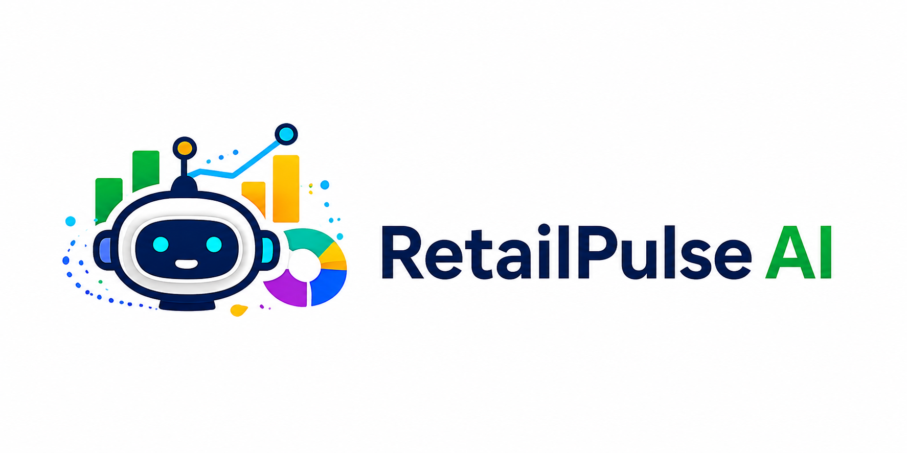

# 🚀 RetailPulse AI
---

### Transforming Retail Data into Intelligent Business Decisions

RetailPulse AI is an autonomous growth agent that helps retailers identify hidden business problems, optimize inventory, predict future risks, and improve profitability using AI-powered recommendations.

## 🎯 Why We Chose This Problem

Retail businesses lose billions every year due to stock shortages, excess inventory, and poor business decisions. Small and medium retailers are affected the most because many still rely on spreadsheets, manual tracking, and experience rather than data-driven insights.

The scale of this problem is significant. Global retailers lose over $1.7 trillion annually due to inventory-related issues, while stockouts alone account for nearly $1 trillion in lost sales. In India, millions of small retailers face similar challenges every day.

We chose this problem because business owners already have valuable data, but they often lack the tools to convert that data into clear decisions. RetailPulse AI helps bridge that gap by identifying problems, explaining their causes, and recommending actions that can improve profitability and business growth.

---

## 💡 Our Solution

RetailPulse AI acts as an AI-powered business co-founder that continuously monitors business performance and provides intelligent recommendations before problems become costly.

---

## ✨ Core Features

* 📊 Sales Analytics
* 📦 Inventory Intelligence
* 🧠 Root Cause Detection
* 📢 Marketing Recommendations
* 📈 Revenue Forecasting
* 🎯 Business Health Score
* 🖥️ Executive Dashboard
* 
---

## 🛠 Tech Stack

* Frontend: React + Tailwind CSS
* Backend: FastAPI
* AI: Gemini / OpenAI
* Database: PostgreSQL

---

## 🌟 What Makes RetailPulse AI Different?

Most retail software tells business owners what happened.

RetailPulse AI tells them:

✅ Why it happened
✅ What action to take
✅ What outcome to expect

---

## 👥 Team

Prompt Pirates

KartiLine Agentic AI Hackathon 2026

